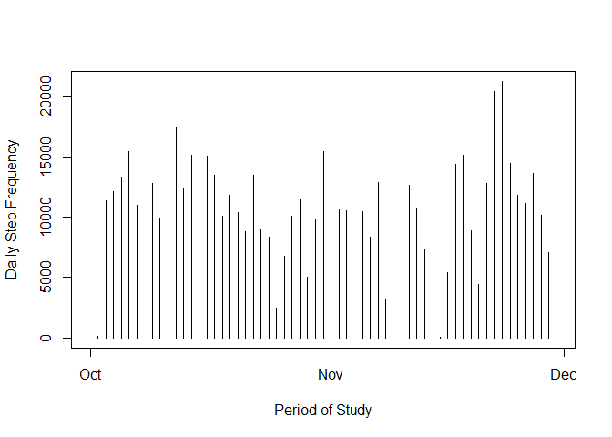
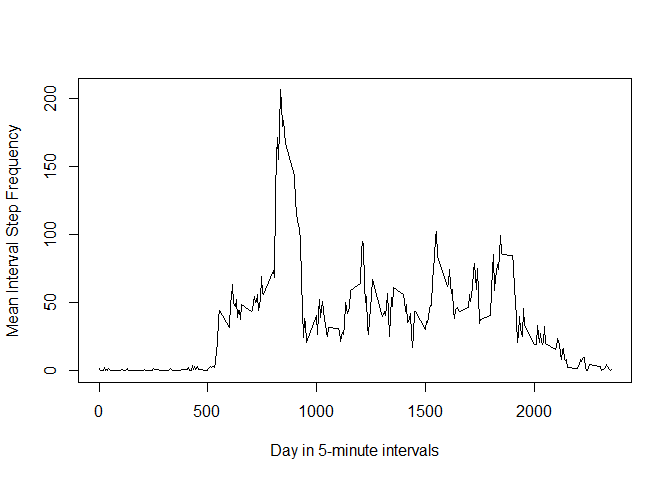
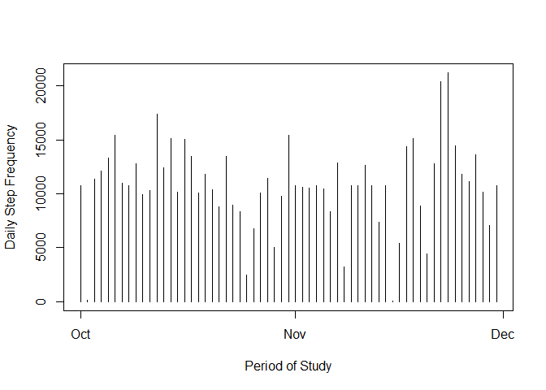
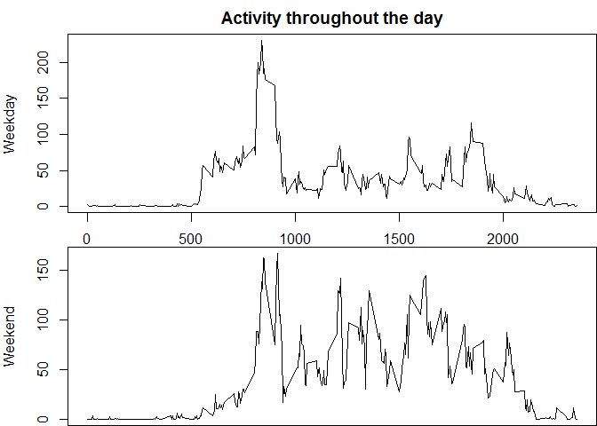

# Reproducible Research: Peer Assessment 1
### PREPARE FOR SOME TERRIBLE INEFFICIENT CODE THAT BARELY DOES THE JOB (but it does the job mostly)
# Loading and preprocessing the data

First load all necessary R packages (I'm out of time and can't get the system messages to stop printing. OOPS.)

```r
library(dplyr)
```

```
## Warning: package 'dplyr' was built under R version 3.2.2
```

```
## 
## Attaching package: 'dplyr'
## 
## The following objects are masked from 'package:stats':
## 
##     filter, lag
## 
## The following objects are masked from 'package:base':
## 
##     intersect, setdiff, setequal, union
```

```r
library(knitr)
```

```
## Warning: package 'knitr' was built under R version 3.2.2
```

```r
library(xtable)
```

```
## Warning: package 'xtable' was built under R version 3.2.2
```

## 1. Load the data

```r
activity <- read.csv("activity/activity.csv",header = TRUE, sep = ",")
```

## 2. Process/transform the data into a format suitable for analysis
 * Copy original dataset since object "activity" will be modified
 * Coerce date column to POSIXct with strptime() and as.POSIXct()
 * Add column for days of the week (I'm sure there's a better way to do this)
 * Create object with data grouped by date, week day, and interval

```r
activity_Original <- activity 
activity$date <- as.POSIXct(strptime(activity$date, format = "%Y-%m-%d"))
activity$weekday <- weekdays(activity$date)
activity_dayGroups <- group_by(activity, date)
activity_intervalGroups <- group_by(activity, interval)
activity_weekdayGroups <- group_by(activity, weekday)
```

# What is mean total number of steps taken per day?

## 1:2. Calculate the total number of steps taken per day and plot them in a histogram

```r
stepTotals_Dates_All <- summarise(activity_dayGroups, steps = sum(steps))
plot(stepTotals_Dates_All$date, stepTotals_Dates_All$steps, type = "h", ylab = "Daily Step Frequency", xlab = "Period of Study")
```

 

## 3. Calculate and report the mean and median of the total number of steps taken per day

```r
mean(na.omit(stepTotals_Dates_All$steps))
```

```
## [1] 10766.19
```

```r
median(na.omit(stepTotals_Dates_All$steps))
```

```
## [1] 10765
```

# What is the average daily activity pattern?

## 1. Make a time series plot of the 5-minute interval and the average number of steps taken, averaged across all days

```r
stepTotals_Intervals <- summarise(na.omit(activity_intervalGroups), steps = sum(steps))
stepMean_Interval <- summarise(na.omit(activity_intervalGroups), steps = mean(steps))
plot(stepMean_Interval$interval, stepMean_Interval$steps, type = "l", ylab = "Mean Interval Step Frequency", xlab = "Day in 5-minute intervals")
```

 

## 2. Calculate which 5-minute interval, on average across all the days in the dataset, contains the maximum number of steps

```r
stepMean_Interval <- summarise(na.omit(activity_intervalGroups), steps = mean(steps))
stepMeanMax <- arrange(stepMean_Interval, desc(steps))        ## Ignore incomplete cases, return max value for steps.  
stepMeanMax[1,]
```

```
## Source: local data frame [1 x 2]
## 
##   interval    steps
##      (int)    (dbl)
## 1      835 206.1698
```

# Imputing missing values
## 1. Calculate and report the total number of missing values in the dataset (steps = NA)

```r
missingRows <- is.na(activity)
sum(missingRows)
```

```
## [1] 2304
```

## 2:3. Fill in missing values using interval means, and create a dataset equal to the original but with the missing values filled in

```r
for(i in 1:length(activity$steps)){
    if(is.na(activity[i,1]) == TRUE){
        activity[i,1] <- stepMean_Interval$steps[stepMean_Interval$interval == activity[i,3]]
    }
}
```
Function evaluates each entry in the steps column of original dataset, and if that entry is found to be NA, the entry is replaced with the mean number of steps for its interval value

## 4. Make a histogram of the total number of steps taken each day, calculate and report mean and median.
First create new grouped data using filled values

```r
activityFilled_dayGroups <- group_by(activity, date)
activityFilled_intervalGroups <- group_by(activity, interval)
activityFilled_WeekdayGroups <- group_by(activity, weekday)
```


```r
stepTotalsFilled_Dates_All <- summarise(activityFilled_dayGroups, steps = sum(steps))
plot(stepTotalsFilled_Dates_All$date, stepTotalsFilled_Dates_All$steps, type = "h", ylab = "Daily Step Frequency", xlab = "Period of Study")
```

 

```r
## Original Figures
mean(na.omit(stepTotals_Dates_All$steps))
```

```
## [1] 10766.19
```

```r
median(na.omit(stepTotals_Dates_All$steps))
```

```
## [1] 10765
```

```r
## Figures with NAs replaced
mean(stepTotalsFilled_Dates_All$steps)
```

```
## [1] 10766.19
```

```r
median(stepTotalsFilled_Dates_All$steps)
```

```
## [1] 10766.19
```
The mean and median appear to change very little.


# Are there differences in activity patterns between weekdays and weekends?

```r
stepTotals_Weekdays_All <- summarise(activityFilled_WeekdayGroups, steps = mean(steps))
print(stepTotals_Weekdays_All[3:4,])
```

```
## Source: local data frame [2 x 2]
## 
##    weekday    steps
##      (chr)    (dbl)
## 1 Saturday 42.75789
## 2   Sunday 41.97491
```

```r
print(stepTotals_Weekdays_All[c(1:2,5:7),])
```

```
## Source: local data frame [5 x 2]
## 
##     weekday    steps
##       (chr)    (dbl)
## 1    Friday 41.68610
## 2    Monday 35.24552
## 3  Thursday 29.50162
## 4   Tuesday 31.07485
## 5 Wednesday 40.54483
```
Weekends average more activity, but they remain close to busy work days.

## 1. Create a new factor variable in the dataset with levels "weekday" and "weekend"

```r
activity <- mutate(activity, dayFactor = 1)
for(i in 1:length(activity$weekday)){
    if(activity[i,4] == "Saturday"|activity[i,4] == "Sunday"){
        activity[i,5] <- "weekend"
    }else{
        activity[i,5] <- "weekday"
    }
}
activity$dayFactor <- as.factor(activity$dayFactor)
```

## 2. Make a panel plot containing time series plots of every interval averaged across weekdays and weekends

```r
weekday_Activity <- activity[activity$dayFactor == "weekday",]
weekend_Activity <- activity[activity$dayFactor == "weekend",]

weekday_Activity_intervalGroups <- group_by(weekday_Activity, interval)
weekend_Activity_intervalGroups <- group_by(weekend_Activity, interval)

stepMean_Interval_weekday <- summarise(weekday_Activity_intervalGroups, steps = mean(steps))
stepMean_Interval_weekend <- summarise(weekend_Activity_intervalGroups, steps = mean(steps))

par(mfrow = c(2,1))
par(mar = c(0,4,2,0))
plot(stepMean_Interval_weekday$interval, stepMean_Interval_weekday$steps, type = "l", ylab = "Weekday", xlab = "", main = "Activity throughout the day")
plot(stepMean_Interval_weekend$interval, stepMean_Interval_weekend$steps, type = "l", ylab = "Weekend", xlab = "Day in 5-minute intervals")
```

 


Oh wow we can actually see the morning commute, meal breaks, and return home during the work week, and people sleeping in on the weekends then going on to more sporadic activity. THIS IS FUN.

